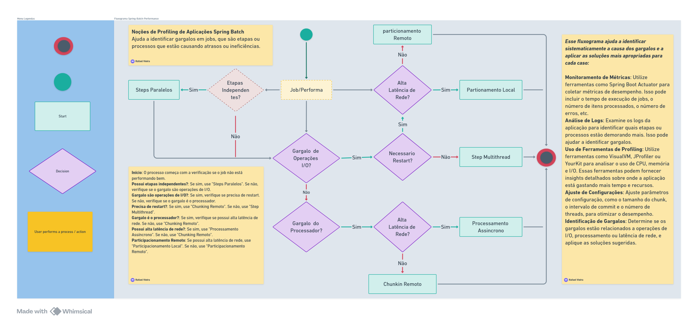
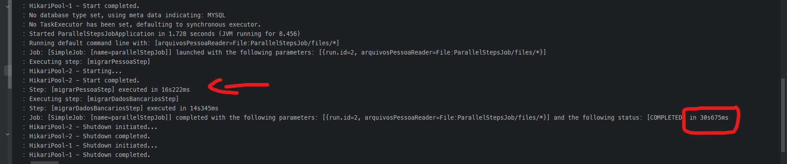
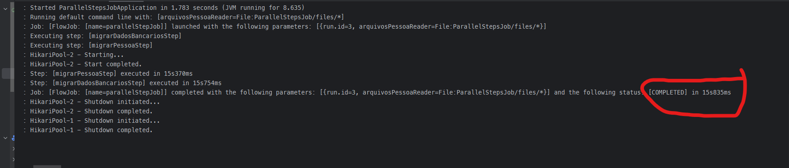
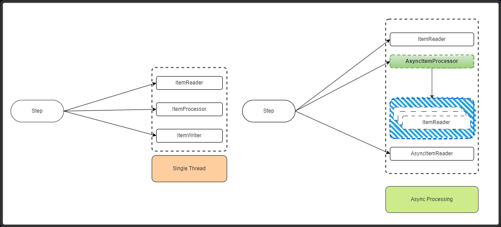
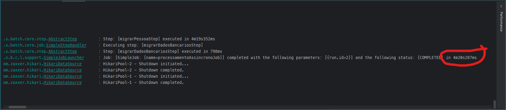
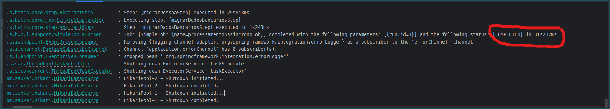
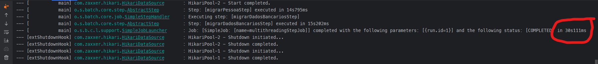
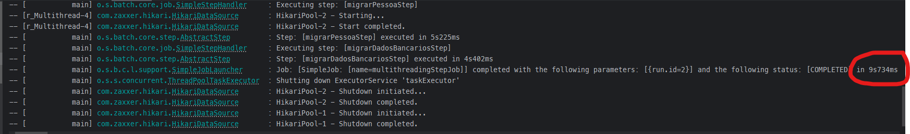

<p align="center">
    
     </a>  
     <a href="https://github.com/ms-sales/README.md/commits/master">
      
     </a>
     <a href="https://github.com/rafaelrok/ms-sales/blob/main/LICENSE">
      
     </a>  
     <a href="https://github.com/tgmarinho/README-ecoleta/stargazers">
      
     </a>
     <a href="https://medium.com/@rafael">
      
     </a>
  </p>
  <h2 align="center"> Spring Batch Performance (NÃO FINALIZADO) </h2>

## Introdução

Este repositório contém projetos focados na otimização de performance de jobs usando Spring Batch. O Spring Batch é um framework robusto para processamento em lote, essencial para lidar com grandes volumes de dados de forma eficiente. A otimização de performance no Spring Batch envolve diversas estratégias para garantir que os jobs sejam executados o mais rápido e eficientemente possível. Este README fornece um guia abrangente para entender e implementar essas técnicas de otimização de performance.

## Tabela de Conteúdos

- [Visão Geral do Spring Batch](#visão-geral-do-spring-batch)
- [Estratégias de Otimização de Performance](#estratégias-de-otimização-de-performance)
    - [Steps Paralelos](#steps-paralelos)
    - [Remote Chunking](#remote-chunking)
    - [Processamento Assíncrono](#processamento-assíncrono)
    - [Multithreading](#multithreading)
    - [Partitioning Local](#partitioning-local)
- [Fluxograma de Decisão](#fluxograma-de-decisão)
- [Exemplos](#exemplos)
- [Conclusão](#conclusão)

## Visão Geral do Spring Batch

Spring Batch é um framework leve e abrangente projetado para habilitar o desenvolvimento de aplicações de lote robustas, vitais para as operações diárias de sistemas empresariais. Ele fornece funções reutilizáveis que são essenciais para o processamento de grandes volumes de registros, incluindo logging/tracing, gerenciamento de transações, estatísticas de processamento de jobs, reinício de jobs, skipping e gerenciamento de recursos.

## Estratégias de Otimização de Performance

### Steps Paralelos

Os steps paralelos permitem que múltiplos steps sejam executados simultaneamente, o que pode reduzir significativamente o tempo total de execução de um job. Isto é particularmente útil quando os steps são independentes uns dos outros.

**Implementação:**

- Configure o job para usar um Split para executar steps em paralelo.
- Assegure-se de que os steps não compartilhem recursos que possam causar contenção.

### Remote Chunking

O remote chunking envolve distribuir o processamento de chunks para workers remotos. Isso pode ser benéfico quando a lógica de processamento é intensiva em CPU e pode ser paralelizada em múltiplos nós.

**Implementação:**

- Utilize Spring Integration para configurar a comunicação entre os nós mestre e trabalhadores.
- Configure o job para enviar chunks para workers remotos processarem.

### Processamento Assíncrono

O processamento assíncrono permite que os steps sejam executados de forma assíncrona, o que pode melhorar a performance ao não bloquear a thread principal enquanto espera por um step ser concluído.

**Implementação:**

- Use `TaskExecutor` para executar steps de forma assíncrona.
- Assegure-se de tratar corretamente a conclusão do step e cenários de erro.

### Multithreading

O multithreading pode ser usado para processar múltiplos itens dentro de um step de forma simultânea. Isto é útil para steps que envolvem operações de I/O ou outras tarefas que podem ser paralelizadas.

**Implementação:**

- Configure o step para usar um `TaskExecutor` para multithreading.
- Assegure a segurança das threads ao acessar recursos compartilhados.

### Partitioning Local

O partitioning local envolve dividir os dados em partições e processar cada partição em paralelo. Isso pode ser útil quando os dados podem ser facilmente particionados e processados de forma independente.

**Implementação:**

- Use um `Partitioner` para dividir os dados em partições.
- Configure o job para processar cada partição em paralelo.

## Fluxograma de Decisão

Profiling é o processo de monitorar e analisar o desempenho de uma aplicação para identificar áreas que podem ser otimizadas. No contexto do Spring Batch, o profiling ajuda a identificar gargalos em jobs, que são etapas ou processos que estão causando atrasos ou ineficiências.
O seguinte fluxograma fornece um processo Profiling de decisão para otimizar a performance de jobs no Spring Batch:



1. **Steps Paralelos:** Verifique se o job tem steps independentes.
2. **Gargalo são operações de I/O?:** Determine se o gargalo é devido a operações de I/O.
3. **Gargalo é o processador?:** Determine se o gargalo é o processador.
4. **Possui alta latência de rede?:** Verifique se há alta latência de rede.
5. **Precisa de restart?:** Determine se o job precisa ser reiniciado.

Dependendo das respostas, o fluxograma sugere diferentes estratégias de otimização como steps paralelos, remote chunking, processamento assíncrono e multithreading.

### **Passos para Profiling de Jobs Spring Batch**
* **Monitoramento de Métricas**: Utilize ferramentas como Spring Boot Actuator para coletar métricas de desempenho. Isso pode incluir o tempo de execução de jobs, o número de itens processados, o número de erros, etc.
* **Análise de Logs**: Examine os logs da aplicação para identificar quais etapas ou processos estão demorando mais. Isso pode ajudar a identificar gargalos.
* **Uso de Ferramentas de Profiling**: Utilize ferramentas como VisualVM, JProfiler ou YourKit para analisar o uso de CPU, memória e I/O. Essas ferramentas podem fornecer insights detalhados sobre onde a aplicação está gastando mais tempo e recursos.
* **Ajuste de Configurações**: Ajuste parâmetros de configuração, como o tamanho do chunk, o intervalo de commit e o número de threads, para otimizar o desempenho.
* **Identificação de Gargalos**: Determine se os gargalos estão relacionados a operações de I/O, processamento ou latência de rede, e aplique as soluções sugeridas.

## Exemplos

Este repositório inclui vários projetos de exemplo demonstrando as diferentes estratégias de otimização de performance:

### Exemplo de `Steps Paralelos`: 
Demonstra como configurar e executar steps paralelos.
No Spring Batch, a estratégia de steps paralelos permite que múltiplos steps sejam executados simultaneamente, o que pode melhorar a performance do processamento de grandes volumes de dados. No seu projeto, isso é configurado usando o Flow e o SimpleAsyncTaskExecutor.  Aqui está um resumo de como isso funciona no seu projeto:  
  - Definição dos Steps: Você tem dois steps definidos, `migrarPessoaStep` e `migrarDadosBancariosStep`, que são responsáveis por processar dados de pessoas e dados bancários, respectivamente.  
  - Configuração dos `Flows`: Cada step é encapsulado em um Flow usando o FlowBuilder. Isso permite que os steps sejam gerenciados como unidades de trabalho independentes.  
  - Configuração do Executor: O `SimpleAsyncTaskExecutor` é usado para executar os flows em paralelo. Este executor cria novas threads para cada flow, permitindo que eles sejam executados simultaneamente.  
  - Combinação dos `Flows`: Os flows são combinados usando o método split, que recebe o `SimpleAsyncTaskExecutor` como parâmetro. Isso indica ao Spring Batch que os flows devem ser executados em paralelo.  
  - Criação do Job: O job é configurado para iniciar com os steps paralelos e finalizar com o método end. O `RunIdIncrementer` é usado para garantir que cada execução do job tenha um ID único.  
  
  #### Aqui está um exemplo de como isso é configurado no seu arquivo ParallelStepJobConfig.java:
  ```java
    @Bean
    public Job parallelStepJob(@Qualifier("migrarPessoaStep") Step migrarPessoaStep,
    @Qualifier("migrarDadosBancariosStep") Step migrarDadosBancariosStep) {
    return jobBuilderFactory
    .get("parallelStepJob")
    .start(stepsParalelos(migrarPessoaStep, migrarDadosBancariosStep))
    .end()
    .incrementer(new RunIdIncrementer())
    .build();
    }
  
    private Flow stepsParalelos(Step migrarPessoaStep, Step migrarDadosBancariosStep) {
    Flow migrarPessoaFlow = migrarPessoaFlow(migrarPessoaStep);
    Flow migrarDadosBancariosFlow = migrarDadosBancariosFlow(migrarDadosBancariosStep);
  
      return new FlowBuilder<Flow>("stepsParalelos")
              .start(migrarPessoaFlow)
              .split(new SimpleAsyncTaskExecutor())
              .add(migrarDadosBancariosFlow)
              .build();
    }
    
    private Flow migrarPessoaFlow(Step migrarPessoaStep) {
    return new FlowBuilder<Flow>("migrarPessoaFlow")
    .start(migrarPessoaStep)
    .build();
    }
    
    private Flow migrarDadosBancariosFlow(Step migrarDadosBancariosStep) {
    return new FlowBuilder<Flow>("migrarDadosBancariosFlow")
    .start(migrarDadosBancariosStep)
    .build();
    }
  ```
  Essa configuração permite que os steps migrarPessoaStep e migrarDadosBancariosStep sejam executados em paralelo, melhorando a eficiência do processamento.
  ##### Aqui a diferença de tempo de execução do job antes e depois da implementação de steps paralelos:
    
    Diferença houve uma redução da metade do tempo de execução do job, de **`30s`** para **`13s`**.
    


### Exemplo de `Remote Chunking`: 
Mostra como configurar o remote chunking usando Spring Integration.
  ```java
    EM PROGRESSO...
  ```
### Exemplo de `Processamento Assíncrono`: 
Fornece um exemplo de execução de steps assíncronos.
  A implementação de processamento assíncrono no Spring Batch pode melhorar significativamente a performance dos jobs, especialmente quando lidamos com grandes volumes de dados. A seguir, descrevo as principais adaptações feitas para melhorar a performance do job com base na sua implementação:  
  - **AsyncItemProcessor**:  
  Utilizado para processar itens de forma assíncrona.
  Configurado com um `TaskExecutor` para controlar a quantidade de threads.
  - **AsyncItemWriter**:  
  Utilizado para escrever itens de forma assíncrona.
  Delegado para um `JdbcBatchItemWriter` que escreve no banco de dados.
  - **TaskExecutor**:
  Configurado com um pool de threads para executar tarefas de forma paralela.
  Utilizado tanto no `AsyncItemProcessor` quanto no Step para paralelizar o processamento e a escrita

Aqui um FluxoGrama de como foi implementado o Processamento Assíncrono:


Segue as implementações. Aqui está a refatoração da classe de processamento com a utilização da configuração Assíncrona: PessoaProcessorConfig.
````java
  @Configuration
  public class PessoaProcessorConfig {
  
    private static final RestTemplate restTemplate = new RestTemplate();
  
    @Bean
    public AsyncItemProcessor<Pessoa, Pessoa> asyncPessoaProcessor() {
      AsyncItemProcessor<Pessoa, Pessoa> processor = new AsyncItemProcessor<>();
      processor.setDelegate(pessoaProcessor());
      processor.setTaskExecutor(taskExecutor());
      return processor;
    }
  
    private ItemProcessor<Pessoa, Pessoa> pessoaProcessor() {
      return new ItemProcessor<Pessoa, Pessoa>() {
  
        @Override
        public Pessoa process(Pessoa pessoa)  throws Exception {
          try {
              String uri = String.format("http://my-json-server.typicode.com/giuliana-bezerra/demo/profile/%d", pessoa.getId());
              ResponseEntity<String> response = restTemplate.getForEntity(uri, String.class);
              System.out.println(response.getBody());
            } catch (RestClientResponseException e) {
              System.out.println(pessoa.getId());
            }
          return pessoa;
        }
      };
    }
  
    @Bean
    public TaskExecutor taskExecutor() {
      ThreadPoolTaskExecutor taskExecutor = new ThreadPoolTaskExecutor();
      taskExecutor.setCorePoolSize(8);
      taskExecutor.setMaxPoolSize(8);
      taskExecutor.setQueueCapacity(8);
      taskExecutor.setThreadNamePrefix("async-multiThreaded-");
      taskExecutor.setRejectedExecutionHandler(new ThreadPoolExecutor.CallerRunsPolicy());
      return taskExecutor;
    }
  
  }
````
Configuração Assíncrona da classe Writer:
````java
  @Configuration
public class BancoPessoaWriterConfig {

  @Bean
  public AsyncItemWriter<Pessoa> asyncBancoPessoaWriter() {
    AsyncItemWriter<Pessoa> asyncItemWriter = new AsyncItemWriter<>();
    asyncItemWriter.setDelegate(bancoPessoaWriter(null));
    return asyncItemWriter;
  }

  @Bean
  public JdbcBatchItemWriter<Pessoa> bancoPessoaWriter(@Qualifier("appDataSource") DataSource dataSource) {
    return new JdbcBatchItemWriterBuilder<Pessoa>()
            .dataSource(dataSource)
            .sql("INSERT INTO pessoa (id, nome, email, data_nascimento, idade) VALUES (?, ?, ?, ?, ?)")
            .itemPreparedStatementSetter(itemPreparedStatementSetter())
            .build();
  }

  private ItemPreparedStatementSetter<Pessoa> itemPreparedStatementSetter() {
    return new ItemPreparedStatementSetter<Pessoa>() {

      @Override
      public void setValues(Pessoa pessoa, PreparedStatement ps) throws SQLException {
        ps.setInt(1, pessoa.getId());
        ps.setString(2, pessoa.getNome());
        ps.setString(3, pessoa.getEmail());
        ps.setDate(4, new Date(pessoa.getDataNascimento().getTime()));
        ps.setInt(5, pessoa.getIdade());
      }

    };
  }
````
Configuração do Step:
````java
  @Configuration
public class MigrarPessoaStepConfig {

  @Autowired
  private StepBuilderFactory stepBuilderFactory;

  @Autowired
  @Qualifier("transactionManagerApp")
  private PlatformTransactionManager transactionManagerApp;

  @SuppressWarnings("unchecked")
  @Bean
  public Step migrarPessoaStep(ItemReader<Pessoa> arquivoPessoaReader,
                               AsyncItemWriter<Pessoa> pessoaWriter,
                               AsyncItemProcessor<Pessoa, Pessoa> pessoaProcessor) {
    return ((SimpleStepBuilder<Pessoa, Pessoa>) stepBuilderFactory
            .get("migrarPessoaStep")
            .<Pessoa, Pessoa>chunk(1000)
            .reader(arquivoPessoaReader)
            .processor((ItemProcessor) pessoaProcessor)
            .writer(pessoaWriter)
            .transactionManager(transactionManagerApp))
            .build();
  }
}
````
Essas adaptações permitem que o processamento e a escrita dos dados sejam realizados de forma paralela, utilizando múltiplas threads, o que resulta em uma melhoria significativa na performance do job.
Segue a demonstração de impacto no desempenho do processamento de jobs assíncronos, onde o tempo estava em torno de `4m` para processar os 1000 clientes, após a implementação o tempo de processamento 
foi reduzido para `30s`.
#### Antes:

#### Depois da implementação:


### Exemplo de `Multithreading`: 
Ilustra como usar multithreading dentro de um step.
#### Classe de configuração do TaskExecutor: 
```java
  @Configuration
  public class TaskExecutorConfig {
  
      /**
       * TODO: Método responsável por criar um TaskExecutor para ser utilizado na execução de tarefas em paralelo, Efetuando uma escalabilidade vertical de desempenho.
       * setCorePoolSize: Aqui é informado o numero de threads que deve ser criado ao executar as tarefas.
       * setQueueCapacity: Aqui é informado o numero de tarefas que podem ser enfileiradas.
       * setMaxPoolSize: Aqui é informado o numero máximo de threads que podem ser criadas.
       * @return TaskExecutor - TaskExecutor que será utilizado para executar as tarefas em paralelo.
       */
  
      @Bean
      public TaskExecutor taskExecutor() {
          ThreadPoolTaskExecutor taskExecutor = new ThreadPoolTaskExecutor();
          taskExecutor.setCorePoolSize(4);
          taskExecutor.setQueueCapacity(4);
          taskExecutor.setMaxPoolSize(4);
          taskExecutor.setThreadNamePrefix("task_executor_Multithread-");
          return taskExecutor;
      }
  }
  ```
#### Configuração do taskExecutor nos Steps Dados Bancrios e pessoas:
```java
  @Bean
public Step migrarDadosBancariosStep(ItemReader<DadosBancarios> arquivoDadosBancariosReader,
                                     ItemWriter<DadosBancarios> bancoDadosBancariosWriter,
                                     @Qualifier("taskExecutor") TaskExecutor taskExecutor) {
  return stepBuilderFactory
          .get("migrarDadosBancariosStep")
          .<DadosBancarios, DadosBancarios>chunk(1000)
          .reader(arquivoDadosBancariosReader)
          .writer(bancoDadosBancariosWriter)
          .taskExecutor(taskExecutor)
          .transactionManager(transactionManagerApp)
          .build();
}
```
  ```java
    @Bean
    public Step migrarPessoaStep(
            ItemReader<Pessoa> arquivoPessoaReader,
            ClassifierCompositeItemWriter<Pessoa> pessoaClassifierWriter,
            ItemProcessor<Pessoa, Pessoa> pessoaProcessor,
            FlatFileItemWriter<Pessoa> arquivoPessoasInvalidasWriter,
            @Qualifier("taskExecutor") TaskExecutor taskExecutor) {
      return stepBuilderFactory
              .get("migrarPessoaStep")
              .<Pessoa, Pessoa>chunk(1000)
              .reader(arquivoPessoaReader)
              .writer(pessoaClassifierWriter)
              .taskExecutor(taskExecutor)
              .stream(arquivoPessoasInvalidasWriter)
              .transactionManager(transactionManagerApp)
              .build();
    }
  ```
#### Configuração do .saveState(false) nos Reader: Não salva o estado da leitura, pois não é sincronizados e não é thread-safe. Então deve ser desabilitado.
obs.: Esta sendo feito essa configuração pois não é possivel restartar o Job.
```java
    @Bean
	public FlatFileItemReader<Pessoa> arquivoPessoaReader() {
		return new FlatFileItemReaderBuilder<Pessoa>()
				.name("arquivoPessoaReader")
				.resource(new FileSystemResource("./MultithreadingStep/files/pessoas.csv"))
				.delimited()
				.names("nome", "email", "dataNascimento", "idade", "id")
				.addComment("--")
				.saveState(false)
				.fieldSetMapper(fieldSetMapper())
				.build();
	}
```
```java
    @Bean
	public FlatFileItemReader<DadosBancarios> dadosBancariosReader() {
		return new FlatFileItemReaderBuilder<DadosBancarios>()
				.name("dadosBancariosReader")
				.resource(new FileSystemResource("./MultithreadingStep/files/dados_bancarios.csv"))
				.delimited()
				.names("pessoaId", "agencia", "conta", "banco", "id")
				.addComment("--")
				.saveState(false)
				.targetType(DadosBancarios.class)
				.build();
	}
```
#### Aqui está o resultado do processamento Multithreading, antes e depois da implementação do TaskExecutor como técnica de escalabilidade vertical de desempenho.
Antes da implementação do TaskExecutor, onde é possível observar o tempo de processamento de **`30s`**.

Resultando após implementação do TaskExecutor, onde é possível observar o tempo de processamento reduzido de **`30s`** para **`9s`**. Isso em uma escala maior de produção poder reduzir em muito o tempo de processamento.


### Exemplo de `Partitioning Local`: 
Demonstra como particionar dados e processar partições em paralelo.
  ```java
    EM PROGRESSO...
  ```

## Conclusão

Otimizar a performance de jobs no Spring Batch é crucial para lidar com grandes volumes de dados de forma eficiente. Utilizando estratégias como steps paralelos, remote chunking, processamento assíncrono, multithreading e partitioning local, você pode melhorar significativamente a performance dos seus jobs.

## Desenvolvedor
<table>
  <tr>
    <td align="center">
      <a href="#">
        <br>
        <sub>
          <b>Rafael Vieira</b>
        </sub>
      </a>
    </td>
  </tr>
</table>
<table>
  <tr>
    <a href="https://www.linkedin.com/in/rafaelvieira-s/">
      
    </a>
    <a href="https://medium.com/@rafael">
      
    </a>
    <a href = "mailto:rafaelrok25@gmail.com">
      
    </a>
  </tr>
</table>


## 📝 Licença

Esse projeto está sob licença. Veja o arquivo [LICENÇA](LICENSE.md) para mais detalhes.

##  Versões do README

[⬆ Voltar ao topo](#introdução)<br>
